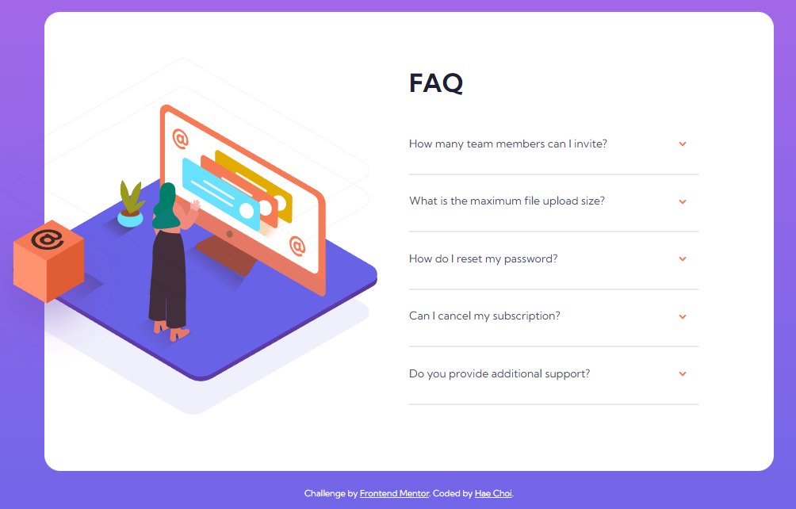
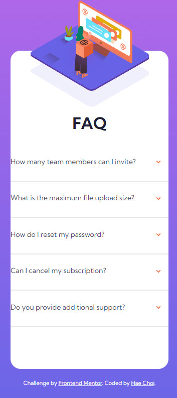

# Frontend Mentor - FAQ accordion card solution (1st Attempt)

This is a solution to the [FAQ accordion card challenge on Frontend Mentor](https://www.frontendmentor.io/challenges/faq-accordion-card-XlyjD0Oam). Frontend Mentor challenges help you improve your coding skills by building realistic projects.

## Overview

### The challenge

Users should be able to:

- View the optimal layout for the component depending on their device's screen size
- See hover states for all interactive elements on the page
- Hide/Show the answer to a question when the question is clicked

### Screenshot

## My process

### Built with

- Semantic HTML5 markup
- CSS custom properties
- Flexbox
- CSS Grid
- js

### What I learned

- Unless set, the height of a grid container is determined by the tallest grid child element.
- How to structure a basic accordion in html and make it function using js.

### Continued development

This was my first attempt in creating a basic accordion. There are various issues to be addressed.

1. Responsive Image positioning
2. Each section in the faq needs to be centered properly
3. Only one section should be open at a time
4. Container and its content should retain an optimal layout as viewport changes.

## Author

- Frontend Mentor - [@dagimchi](https://www.frontendmentor.io/profile/dagimchi)
- Twitter - [@dagimchi](https://www.twitter.com/dagimchi)

## Acknowledgments

Thanks to Kingsley Ubah for the accordion how-to article.

https://www.freecodecamp.org/news/build-an-accordion-menu-using-html-css-and-javascript/
